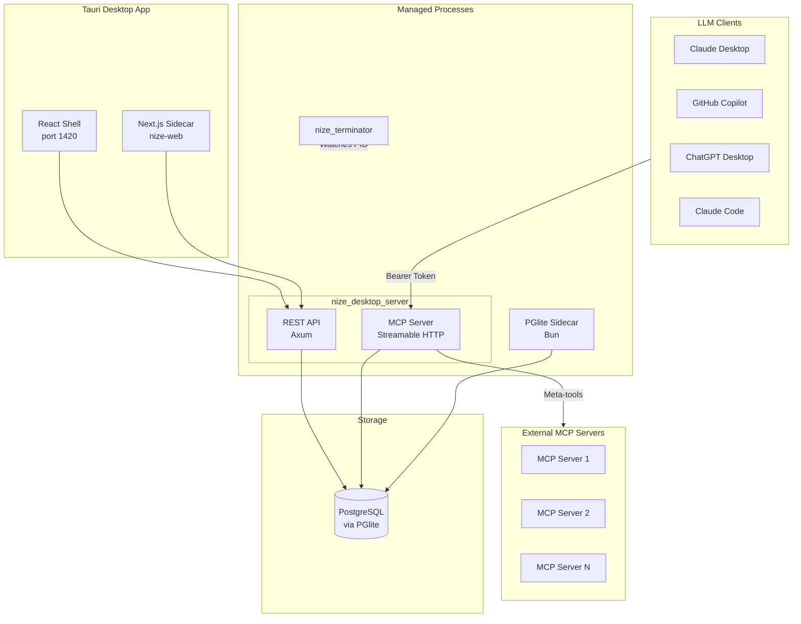
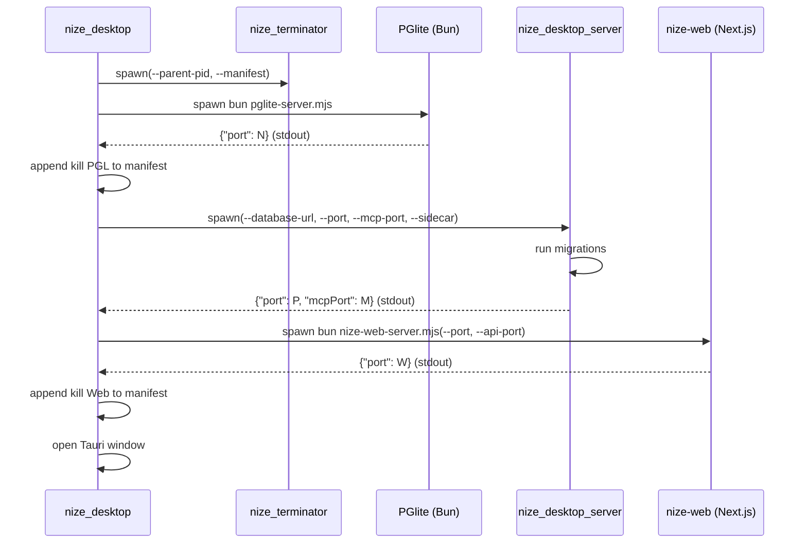
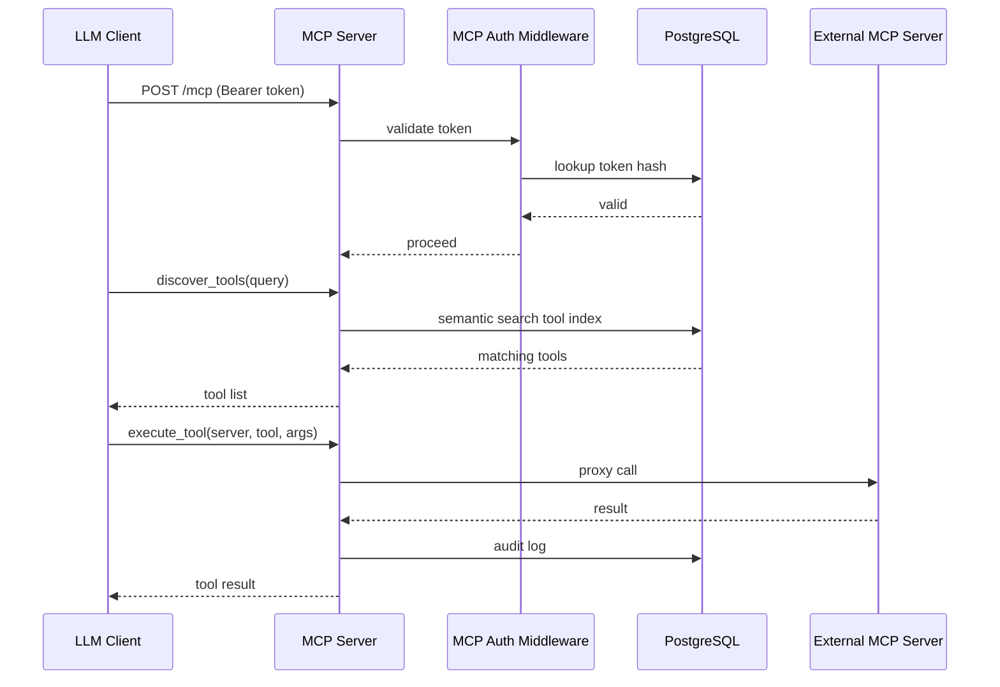
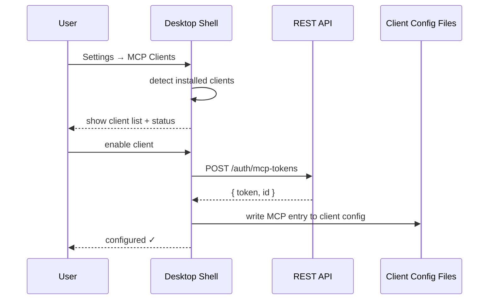

# Architecture

## Project Purpose

Nize MCP is an AI-powered desktop application that exposes a single MCP (Model Context Protocol) server as the unified interface for LLMs to access tools, skills, and workflows — acting as a meta MCP server that aggregates external MCP servers and provides hooks/middleware for security, ontology, and auditing.

## System Overview

- Desktop Application Shell (Tauri + React)
- REST API Layer (Axum)
- MCP Server Layer (Streamable HTTP via rmcp)
- Core Domain Logic (nize_core)
- Embedded Web Application (Next.js sidecar)
- Embedded Database (PGlite via Bun sidecar)
- Process Lifecycle Management (nize_terminator)
- Code Generation Pipeline (TypeSpec to OpenAPI to Rust/TypeScript)

## Technology Stack

- `Rust 1.93` — Backend language for all server-side crates
- `Tauri 2` — Desktop application framework (native webview shell)
- `Axum 0.8` — HTTP framework for REST API and MCP transport
- `rmcp 0.15` — MCP SDK with Streamable HTTP server transport
- `SQLx 0.8` — Async PostgreSQL driver with compile-time query checking
- `PostgreSQL 16` — Primary database (via PGlite for local, standard PG for cloud)
- `PGlite` — Embedded PostgreSQL running in Bun for local desktop use
- `React 19` — Desktop shell UI framework
- `Vite` — Frontend build tool and dev server for desktop shell
- `Next.js 16` — Embedded web application (chat interface, future features)
- `TypeSpec 0.64` — API contract definition (generates OpenAPI YAML)
- `TypeScript 5` — Frontend and tooling language
- `Bun 1.3` — Runtime for PGlite sidecar and nize-web sidecar
- `Progenitor 0.12` — Rust HTTP client codegen from OpenAPI
- `wasm-bindgen` — WASM bindings for nize_core in browser/CLI contexts
- `JWT` — Stateless authentication (access + refresh tokens)

## High-Level Architecture



## Directory Structure

```
crates/app/nize_desktop/           # Tauri desktop app (process orchestrator)
crates/app/nize_desktop_server/    # API + MCP sidecar binary
crates/app/nize_cli/               # CLI entry point
crates/app/nize_codegen/           # OpenAPI-to-Rust code generator
crates/app/nize_terminator/        # Orphan process reaper
crates/lib/nize_core/              # Core domain: auth, config, DB, migrations
crates/lib/nize_mcp/               # MCP server library (tools, auth middleware)
crates/lib/nize_api/               # REST API library (routes, handlers, services)
crates/lib/nize_api_client/        # Generated Rust HTTP client (via Progenitor)
crates/wasm/nize_wasm/             # WASM bindings for nize_core
packages/nize-desktop/             # React + Vite desktop shell (Tauri frontend)
packages/nize-web/                 # Next.js embedded web app (chat UI, settings)
packages/nize-cli/                 # TypeScript CLI wrapper (uses nize_wasm)
packages/nize-api-client/          # Generated TypeScript API client
packages/nize-api-types/           # Generated TypeScript API types
.awa/specs/API-*.tsp               # TypeSpec API contracts (source of truth)
codegen/nize-api/tsp-output/       # Generated OpenAPI YAML
```

## Component Details

### Desktop Application (nize_desktop)

Tauri application that orchestrates all managed processes and presents the desktop UI.

RESPONSIBILITIES

- Start and manage PGlite, API sidecar, nize-web sidecar, and nize_terminator
- Expose Tauri commands for frontend (get_api_port, get_mcp_port, get_nize_web_port)
- Detect installed LLM clients and configure MCP server entries
- Create and manage MCP bearer tokens for each LLM client
- Graceful shutdown of all child processes on exit

CONSTRAINTS

- Must run all sidecars as child processes with stdin pipe for lifecycle coupling
- Must support both PGlite (local) and external DATABASE_URL modes
- Must write cleanup manifest for nize_terminator crash recovery

### Desktop Server (nize_desktop_server)

Single binary combining the REST API and MCP server, started as a sidecar by the desktop app.

RESPONSIBILITIES

- Bind REST API and MCP server on separate ports
- Run database migrations on startup
- Report bound ports to parent via JSON on stdout
- Exit when parent pipe closes (sidecar mode)

CONSTRAINTS

- Must be stateless (no in-process sessions)
- stdout is reserved for the JSON port message; logs go to stderr

### REST API (nize_api)

Axum-based HTTP API providing authentication, configuration, and management endpoints.

RESPONSIBILITIES

- Authenticate users via JWT (login, register, refresh, logout)
- Manage MCP bearer tokens (create, list, revoke)
- Serve hierarchical configuration (system defaults, user overrides)
- Validate all inputs
- Expose OpenAPI-compatible endpoints

CONSTRAINTS

- API contracts defined in TypeSpec (.tsp) as single source of truth
- Route constants generated from OpenAPI; handlers must not hardcode paths
- Must support CORS for cross-origin access from desktop shell and nize-web

### MCP Server (nize_mcp)

Streamable HTTP MCP server providing meta-tools for LLM tool discovery and execution.

RESPONSIBILITIES

- Expose meta-tools to LLMs (discover, execute, browse external MCP tools)
- Authenticate MCP requests via bearer token middleware
- Proxy tool execution to registered external MCP servers
- Provide hooks/middleware pipeline for security, ontology, and auditing

CONSTRAINTS

- Must use Streamable HTTP transport (rmcp)
- Must not expose individual external tools directly; meta-tools only
- All tool executions must be auditable
- Must authenticate every request via MCP bearer tokens

### Core Domain (nize_core)

Shared domain logic used by both the API and MCP server.

RESPONSIBILITIES

- User authentication (password hashing, JWT issuance, MCP token validation)
- Database schema and migrations (SQLx)
- Configuration system (definitions, values, cache, resolution, validation)
- PGlite process management (start, stop, connection URL)
- Bun sidecar availability detection

CONSTRAINTS

- Must not depend on any HTTP framework (framework-agnostic)
- Migrations owned exclusively by nize_core

### Desktop Shell (nize-desktop)

React + Vite frontend loaded in the Tauri webview.

RESPONSIBILITIES

- Render settings UI (MCP client configuration, user preferences)
- Authentication gate (login/register flow)
- Host nize-web in an iframe for chat and content features
- Proxy API and nize-web requests via Vite dev server (same-origin in dev)

CONSTRAINTS

- Must not contain business logic (presentation only)
- Must discover API port via Tauri commands, not hardcoded URLs (except debug defaults)

### Embedded Web App (nize-web)

Next.js application served as a sidecar for feature-rich UI (chat, content).

RESPONSIBILITIES

- Provide chat interface (future)
- Provide content management UI (future)
- Run as standalone Next.js server managed by the desktop app

CONSTRAINTS

- Must accept API port via CLI argument for backend discovery
- Must support both dev (hot-reload) and production modes

### Process Lifecycle (nize_terminator)

Standalone binary that cleans up orphaned processes after an unclean desktop app shutdown.

RESPONSIBILITIES

- Watch parent PID; activate cleanup when parent dies
- Execute cleanup commands from manifest file (kill processes, remove lock files)
- Self-terminate after cleanup

CONSTRAINTS

- Must not depend on any nize crate (standalone, minimal dependencies)
- Must work on both Unix and Windows

### Code Generation Pipeline

TypeSpec-driven pipeline generating API server stubs, client SDKs, and types.

RESPONSIBILITIES

- Compile TypeSpec (.tsp) to OpenAPI 3 YAML
- Generate Rust route constants and models (nize_codegen)
- Generate Rust HTTP client (Progenitor / nize_api_client)
- Generate TypeScript API client and types (openapi-typescript)

CONSTRAINTS

- Generated code must not be manually edited
- TypeSpec contracts are the single source of truth for all API shapes

### WASM Module (nize_wasm)

WebAssembly build of nize_core for use in browser and CLI contexts.

RESPONSIBILITIES

- Expose nize_core functions to JavaScript/TypeScript via wasm-bindgen
- Power the nize-cli TypeScript package

CONSTRAINTS

- Must be optimized for size (release profile: opt-level "z", LTO, strip)

## Component Interactions

The Tauri desktop app starts PGlite, the API sidecar (nize_desktop_server), the nize-web sidecar, and nize_terminator. The desktop shell (React) and nize-web (Next.js) communicate with the REST API. External LLM clients (Claude, Copilot, ChatGPT) connect to the MCP server using bearer tokens created through the API. The MCP server proxies tool calls to registered external MCP servers.

### Desktop Startup Flow



### MCP Tool Execution Flow



### MCP Client Auto-Configuration Flow



## Architectural Rules

- All database access must go through SQLx with compile-time checked queries
- API contracts must be defined in TypeSpec; generated code must not be manually edited
- The MCP server must authenticate every request via bearer token middleware
- Core domain (nize_core) must remain framework-agnostic; no Axum/Tauri dependencies
- All child processes must be tracked in the terminator manifest for crash recovery
- The desktop app must support both PGlite (local) and external PostgreSQL modes
- Secrets (JWT secret, MCP tokens) must never be exposed to frontend code
- MCP tool execution must be proxied through the meta-tools pattern; no direct exposure
- All async operations must have proper error handling and timeouts
- The REST API must be stateless; no server-side sessions
- stdout of sidecar binaries is reserved for structured JSON; logs go to stderr
- WASM builds must be optimized for size (opt-level "z", LTO, strip)

## Release Status

STATUS: Pre-Alpha

Desktop app bootstrapped with PGlite, API sidecar, MCP server, nize-web sidecar, auth, config, and MCP client auto-configuration. MCP meta-tools (discover, execute, embed, search) not yet implemented. Chat interface not yet implemented. This project is NOT in production; the DB can be cleared and migrations are not necessary.

## Developer Commands

- `cargo tauri dev` — Start full desktop dev environment (Vite + Rust + sidecars)
- `cargo build` — Build default workspace members (nize_cli, nize_core, nize_mcp)
- `cargo test` — Run Rust test suites
- `cargo clippy` — Run Rust linter
- `bun run generate:api` — Generate API code from TypeSpec contracts
- `bun install` — Install JS dependencies for all workspaces
- `cd packages/nize-desktop && bun run build:pglite-server` — Build PGlite sidecar bundle
- `cd packages/nize-desktop && bun run build:nize-web` — Build nize-web for production

## Change Log

- 0.1.0 (2026-02-14): Initial architecture
